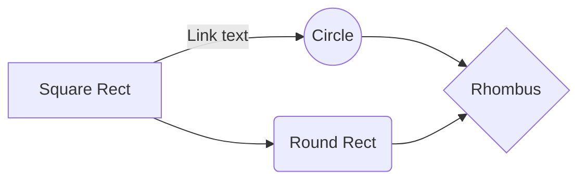


# Release Notes bartender - Release 6.1.4

## Overview

BuildDate: **2019-03-06T16:31:53**

Authors: **Adrian.Andersson**

BuildUser: **Adrian.Andersson**

Company: **Domain Group**

---
## Functions in Release

### Unmodified

|function|type|mdLink|filename|
|-|-|-|-|
|get-btScriptText|Public|[link](/get-btScriptText.md)|.\get-btScriptText.ps1|
|publish-btModule|Public|[link](/publish-btModule.md)|.\publish-btmodule.ps1|
|clear-btRepository|Public|[link](/clear-btRepository.md)|.\clear-btRepository.ps1|
|get-btDefaultSettings|Public|[link](/get-btDefaultSettings.md)|.\get-btDefaultSettings.ps1|
|get-btInstalledModule|Public|[link](/get-btInstalledModule.md)|.\get-btInstalledModule.ps1|
|get-btRepository|Public|[link](/get-btRepository.md)|.\get-btRepository.ps1|
|save-btRepository|Public|[link](/save-btRepository.md)|.\save-btRepository.ps1|
|start-btbuild|Public|[link](/start-btbuild.md)|.\start-btbuild.ps1|
|start-btTestPhase|Public|[link](/start-btTestPhase.md)|.\start-btTestPhase.ps1|
|update-btFileStructure|Public|[link](/update-btFileStructure.md)|.\update-btFileStructure.ps1|
|update-btProject|Public|[link](/update-btProject.md)|.\update-btProject.ps1|
|add-btBasicTests|Private||.\add-btBasicTests.ps1|
|add-btFilesAndFolders|Private||.\add-btFilesAndFolders.ps1|
|get-btDocumentation|Private||.\get-btDocumentation.ps1|
|start-btRevisionCleanup|Private||.\start-btRevisionCleanup.ps1|

### Modified

|function|type|mdLink|filename|
|-|-|-|-|
|get-btFolderItems|Public|[link](/get-btFolderItems.md)|.\get-btFolderItems.ps1|
|new-btProject|Public|[link](/new-btProject.md)|.\new-btproject.ps1|
|save-btDefaultSettings|Public|[link](/save-btDefaultSettings.md)|.\save-btDefaultSettings.ps1|

### New or Moved

|function|type|mdLink|filename|
|-|-|-|-|
|get-btChangeDetails|Public|[link](/get-btChangeDetails.md)|.\get-btChangeDetails.ps1|
|get-btGitDetails|Public|[link](/get-btGitDetails.md)|.\get-gitConfig.ps1|
|get-btScriptFunctions|Private||.\get-btScriptFunctions.ps1|
|new-btReleaseMarkdown|Private||.\new-btReleaseMarkdown.ps1|

**Notes:**
 - For Public Functions, check the relevant markdown link
 - For Private Functions, check the file sourcecode

---
## Required Modules

|moduleName|requiredVersion|
|-|-|
|Pester|4.6.0|
|platyPS|0.12.0|
|Configuration|1.3.1|

---
## Pester Details

CodeCoverage: **74 %**

Passed: **100 %**

TimeToTest: **00:03:37.0732805**

---
## Git Details

Branch: **master**

Origin: **https://github.com/DomainGroupOSS/bartender**

Commit: **40568f5**

---
###mermaid

